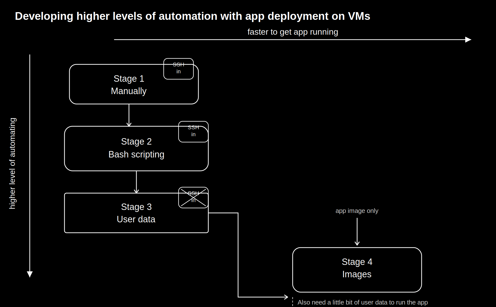
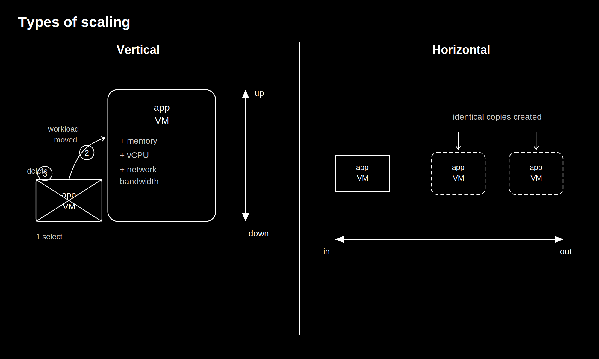
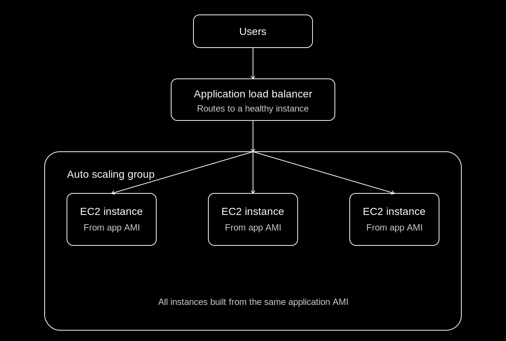
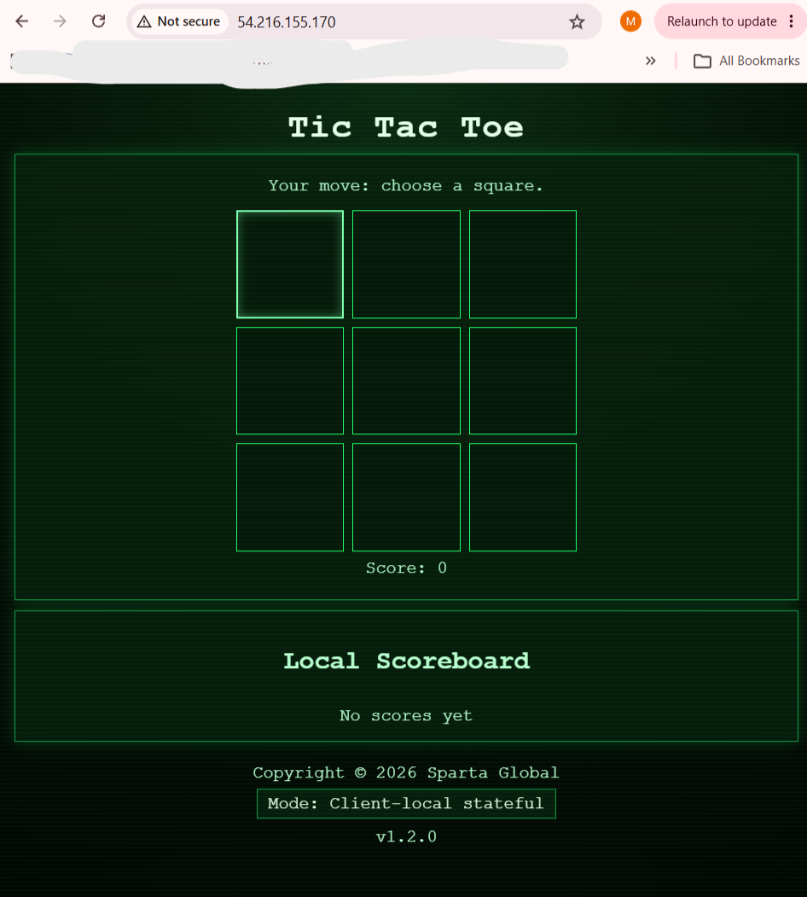
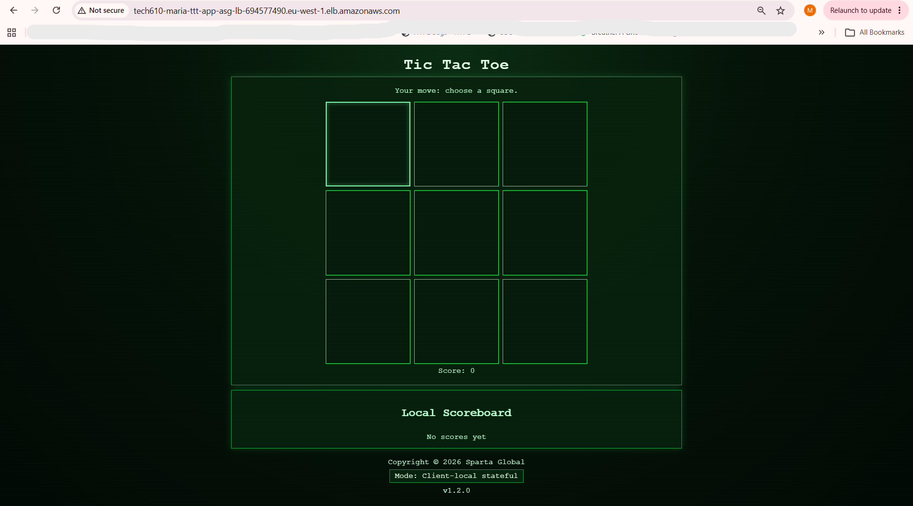

# Auto Scaling (High Availability)

## Overview

This guide covers building a highly available application on AWS using an **Application AMI**, **Launch Template**, **Application Load Balancer**, and **Auto Scaling Group**.

Goals:
- distribute traffic across multiple EC2 instances
- automatically replace unhealthy instances
- scale capacity as needed
- reduce manual intervention

---

## Automation

Automate tasks that are repetitive, time-consuming, or costly to do manually, but only when the effort to automate is justified. Ask: *"Is this actually worth automating?"*

---

## Virtualised vs Containerised

This describes the different ways an app is packaged and run: 

> **Virtualised deployment**- where each EC2 instance runs its own OS that your EC2 or AMI set up uses. 
>
>* ***This project uses virtualised deployment***
>
> 
**Note:** *None of these stages switch to containers, they're all full VMs with their own OS (own drivers, kernel and all)*

**Containerised deployment**- instead runs the app in lightweight containers sharing a host OS, so it is not a full VM- it only packages the app and its dependencies (libraries, runtime, config). This is faster and lighter, but *not used here*.


### Other key differences::
------------
| | VM (virtualised) | Container (Docker) |
|---|---|---|
| Includes own OS kernel | Yes | No (shares host kernel) |
| Startup time | Slower (boots an OS) | Fast (just starts a process) |
| Size | Large (GBs) | Small (MBs) |
| Isolation | Full (separate OS) | Process-level (shared kernel) |


-----------------
## Vertical vs Horizontal scaling

Scaling is where the amount of computing capacity available to an application is adjusted so it can handle more or less traffic at a time, without breaking or wasting money. 

### Different types of scaling:
**Vertical scaling**- Upgrades the existing resource (e.g. increasing CPU, memory, network,bandwidth on the same server)

**Horizontal scaling**- Adds more copies of the resource (more servers/ instances working in parallel and spreading connections across healthy networks to avoid an app being down)

> 
**Visualization showing the differences between vertical and horizontal scaling:**

---

## Architecture
>
**Visualization showing how the load balancer distributes web traffic to healthy connections**

- **Application Load Balancer** —> single entry point for all traffic
- **Auto Scaling Group** —> manages EC2 instance count and health
- **EC2 instances** —> all launched from the same Application AMI

Users no longer connect directly to an instance. All requests hit the Load Balancer first, which routes them to a healthy instance.

---

## Why an Application AMI?

Previously, a large User Data script installed Node.js, cloned the repo, installed dependencies, and started PM2 on every new instance (slow and repetitive).

An **Application AMI** is a snapshot of a fully configured server. New instances launch from it already containing the app, Node.js, PM2, and dependencies (much faster to spin up).

---

# Creating the Launch Template

Tells AWS how to launch new instances.

1. **EC2 Dashboard → Launch Templates → Create launch template**
2. Name it, e.g. `tech610-maria-ttt-app-asg-lt`
3. Under AMI, select your **Application AMI**
4. Select your usual security group (HTTP 80, SSH 22; port 3000 if needed)
5. Under **Advanced details → User Data**, add:

```bash
#!/bin/bash
cd /tech610-tic-tac-toe/app
pm2 start index.js --name tic
```

(The AMI already has everything installed, this just starts the app.)

6. **Create launch template**

**Test it:** Launch an instance from the template, open its Public IP in a browser, and confirm the app loads before continuing.


---

# Creating the Auto Scaling Group

1. **Launch Templates** → select your template → **Actions → Create Auto Scaling Group**

   1b. Name it, e.g. `tech610-maria-ttt-app-asg` → **Next**

### 2. Network
- Default VPC
- **All available subnets** (spreads instances across Availability Zones for resilience)
- Balancing: **Balance Best Effort**

### 3. Load Balancer
- **Attach to a new load balancer** → **Application Load Balancer**
- Name it, e.g. `tech610-maria-ttt-app-lb`
- Scheme: **Internet-facing**
- Listener: HTTP, port **80**

### 4. Target Group
- Create new, e.g. `tech610-maria-ttt-app-tg`
- Tracks which instances are healthy; unhealthy ones stop receiving traffic automatically

### 5. Health Checks
- Enable **Elastic Load Balancing health checks**
- **Health check grace period: 90 seconds** (gives new instances time to boot before being checked)

### 6. Group Size

| Setting | Value |
|---|---:|
| Desired capacity | 2 |
| Minimum capacity | 2 |
| Maximum capacity | 3 |

> Extra running instances cost more so **MUST** scale down or delete when done testing.

### 7. Scaling Policy
- **Target tracking scaling policy**
- Instance warmup: **90 seconds**

### 8. Notifications
- Skip (not used in this deployment)

### 9. Tags
Add a Name tag, e.g. `tech610-maria-ttt-app-ha-sc` because  without it, launched instances get random names.

Review and **Create Auto Scaling Group**.

---

# Testing

1. Open the Auto Scaling Group → **Integrations** tab → open the linked **Load Balancer**
2. Copy its **DNS name** and open it in a browser and the app should load


Users should now access the app via the **Load Balancer's DNS name**, not an instance's Public IP.

### High availability test
Terminate a running instance. The Auto Scaling Group should detect the loss, launch a replacement, register it with the Target Group, and keep serving traffic without interruption.

---

# Cleaning Up

Delete in this order:
1. Load Balancer
2. Target Group
3. Auto Scaling Group

**Not ready to delete?** Set Min and Max capacity to `0` to stop instances running while keeping the configuration.

---

# Types of Scaling

- **Manual** —> capacity changed by hand
- **Scheduled** —> scales on a predefined schedule (e.g. more capacity on weekday mornings)
- **Dynamic** —> scales automatically based on CloudWatch metrics (CPU, traffic, request count). This deployment uses **Target Tracking Scaling**, a form of dynamic scaling.

---

# Reflection

This deployment covered creating an Application AMI, Launch Template, Load Balancer, Target Group, and Auto Scaling Group with health checks, demonstrating how these AWS services combine to keep an application highly available and self-healing with minimal manual effort.