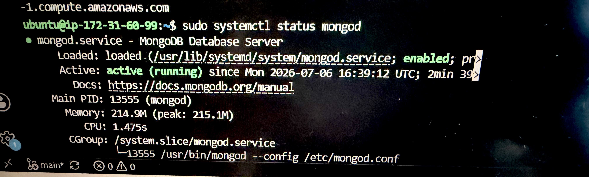

# MongoDB Notes: Two-tier Deployment + Architecture

---

## Overview

Focusing on deploying **MongoDB** as the database layer in a **Two-Tier Architecture**.

This architecture is considered **two-tier** because:
1. The **application** runs on one virtual machine (VM),
2.  **MongoDB** runs on a separate virtual machine (VM),

   - And  communicates with the database over the network.

---

> **Best Practice:** Do not run the application and the database on the same VM in a production-style deployment.

---

# Two-Tier Architecture

```text
              User
                │
                ▼

        +----------------+
        | Application VM |
        +----------------+
                │
        MongoDB (27017)
                │
                ▼
        +----------------+
        |   MongoDB VM   |
        +----------------+
```

---

# Technologies Used

- Ubuntu 24.04 LTS
- MongoDB 8.2.5
- EC2 Virtual Machines
- SSH
- Security Groups

---

# MongoDB Port

MongoDB listens on the default port:

```text
27017
```

The MongoDB VM requires a security group (SG) rule allowing inbound traffic on **port 27017**, so I had to customise a new SG and rule.

### Security Considerations

- Only allow trusted IP addresses to access MongoDB.
- If your public IP changes (for example, when moving between home and office Wi-Fi), remember to update the security group rule.

---

# Practical session : 
# 1. *Connecting to the MongoDB Server*


 SSH into the database virtual machine:

```bash
ssh -i "~/.ssh/maria-tech610-key.pem" ubuntu@ec2-108-130-137-64.eu-west-1.compute.amazonaws.com
```

---

## Understanding `~/.ssh`

The `~` symbol represents your **home directory**.

For example:

Linux:

```text
/home/username/.ssh
```

Windows (Git Bash):

```text
C:\Users\Username\.ssh
```

The `.ssh` directory is the standard location for storing SSH keys.

---

# 2. *Update the Server*

Update the package list:

```bash
sudo apt-get update -y
```

Upgrade installed packages:

```bash
sudo apt-get upgrade -y
```

---

# 3. *Installing MongoDB*

Use the **official MongoDB documentation** to install:

- **MongoDB 8.2.5**
- **Ubuntu 24.04 LTS**

This version has been tested by the development team and should be used to maintain compatibility.

---

# 4. *Checking the MongoDB Service*

Verify that MongoDB is running:

```bash
sudo systemctl status mongod
```

Check the status of all system services:

```bash
sudo systemctl status
```



---

# Application Data

The Tic Tac Toe application includes a **seeded scoreboard**.

This means the database already contains sample data when the application starts.

As users play:

- New scores are written to MongoDB.
- All browser tabs access the same shared data.
- Every user connects to the same database instance.

---

# Persistent Storage

MongoDB provides **persistent storage**.

This means that data remains stored even if:

- The application stops
- The application restarts
- The server is rebooted

Only deleting or losing the database itself would result in data loss.

---

# Verifying the Application is Connected

You can tell the application is communicating with MongoDB if:

- The MongoDB service is running.
- The application starts successfully.
- Existing scoreboard data is displayed.
- New scores are saved correctly.
- Refreshing the application does not remove the scores.
- Multiple browser tabs show the same shared scoreboard.

---

# Summary

- MongoDB is deployed on a separate VM from the application.
- MongoDB communicates over **port 27017**.
- Only trusted IP addresses should be allowed through the security group.
- Use **MongoDB 8.2.5** on **Ubuntu 24.04 LTS**.
- Check MongoDB with:

```bash
sudo systemctl status mongod
```

- MongoDB provides **persistent storage**, allowing application data to survive restarts.

[provision mongodb script](prov-db.sh)