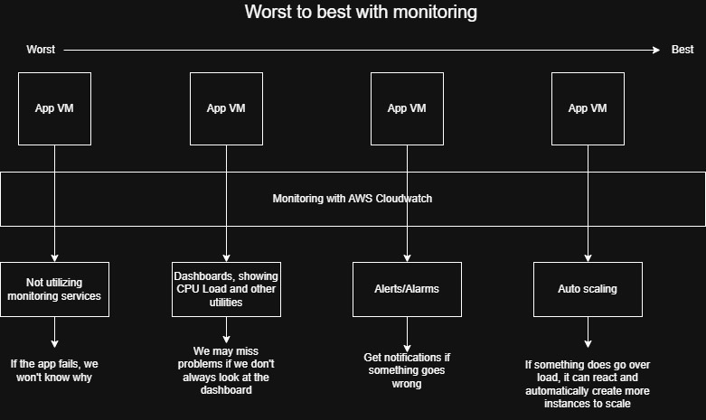
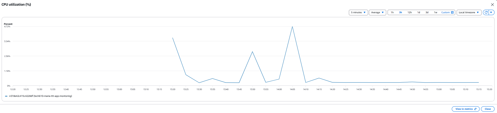
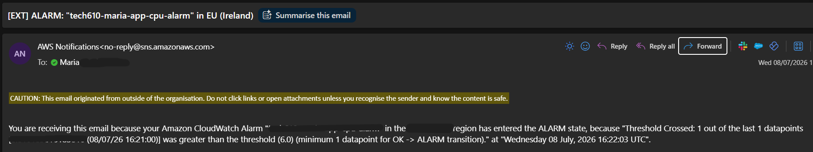

# Monitoring, Alert Management and Autoscaling

## Overview
A step-by-step guide to monitoring the performance of an AWS EC2 application using Amazon CloudWatch, including how to:
- collect and visualise performance metrics
- perform load testing with Apache Bench (`ab`)
- create a CPU usage alarm, and receive email notifications when the predefined thresholds exceeded.
  

#### For the performance testing section, we will be:
* Concentrating on load testing
* Using a tool called Apache bench (`ab`)
* Monitoring and taking note of what happens to the cpu usage under load.
----------
## Why do we monitor applications?
Applications can sometimes experience more web traffic than usual, experience a decline overtime in efficiency or reliability and soemtimes fail. 

Monitoring is what lets us observe the health and performance of the app in real time, helping us to detect issues before users are impacted by them.


### Reasons for monitoring:
- To measure app performance
- Spot bottlenecks like high CPU utilization
- Spot failures and unusual changes
- Receive alerts when predefined thresholds are exceeded
- Make informed descisions about scaling infrastructure


## Ranking the WORST to BEST approaches to monitoring

Monitoring can range from no visisbility into an app's health to automatically responding to problems.

The **best** monitoring systems give detailed insights into **system performance** and **react quickly** when issues occur.



##### Image illustrating the best and worst approaches to monitoring.
----------------

# What is performance testing?
Perfomance testing is the process of evaluating how an application behaves under different levels of workload. 

## Why is it necessary?
It helps to see if an application will still be stable, reliable and responsive as the number of users or requests being sent increases.

### Performance testing can be summed up in these three questions: 

**1**. *"Is the app working well generally/ under normal conditions?"*

**2**. *"How much traffic can the app handle before it breaks?"*
 
**3**. *"What happens when it reaches or exceeds its breaking point?"*

## Types of performance testing
*This documentation focuses on two common types:*
 - **Load testing**- Measuring how the application persorms under expected or normal levels of traffic.


- **Stress testing**- Pushing the application beyond its expected capacity to see it's breaking point and how it recovers.

  


# Preparing for load testing

### 1. Turn on detailed monitoring 
1. Go to the **EC2 Dashboard**.

2. Click **Instances**.

3. Select your **app instance**.

4. Go to the **Monitoring** tab.

5. Click **Manage detailed monitoring**.

6. Tick **Enable**.

7. Click **Confirm**.
(to switch off, go back in and disable it, unclick enable).

### 2. Create a dashboard
### Using these 8 steps:
-----
1. Go to **Explore related**.

2. Click the 3 little dots.

3. Click **'Add to dashboard'** and you'll get a pop up in a new tab.

4. Takes you to cloud watch dashboard in AWS, where you can use an **existing dashboard** *(skip to step 7 if so!)*.

 5. If you do not have a dashboard you can use for this project, then you must **create a new dashboard** and name it:

*e.g.  `tech610-maria-test-app-vm-dashboard`* 
 
6. Click **'CREATE'**

7. Now that the dashboard has been selected, click **'Add to dashboard'**.

 **Expected outcome:**
 Your dahsboard for the instance you created should now appear on your screen. 
 
 8. Monitor and delete elements as necessary: *e.g. `Meta data, CPU duplicates, etc`.*
-----------

----------
### Instructions to follow in dashboard
---------------
**1**. Click **maximise icon** for the **CPU utilization(%) per minute**.

**2**. Change the time toggle from **'UTC'** to **'Local time'** for accuracy.
* **Note**: *Consider whether you are required to work in your current time-zone or across others, and choose as applicable.*


**3**. *(Optional)*: Check the dots and timestamps to confirm that the dashboard is accurate to the time frame selected for monitoring, such as 'every 5 minutes'.

**4**. Change the toggle to every **'1 minute'** for more frequent tracking.

**5**. Narrow down the moments you want to track by selecting if you want to see the dashboard's summary over the past **1h**, **3h** or more.

## Next steps...
Now that monitoring has been configured we must **simulate** traffic coming in on http, otherwise known as **web traffic** to perform **load testing**.

### Why?
To observe how:
- the CPU utilization reacts and changes in Cloudwatch.

------------

# Performing load testing

## Using Apache Bench

### Step 1: 
-------------------
#### Update
```bash
sudo apt-get update
```
--------------------
### Step 2: 
--------------------
#### install apache
```bash
sudo apt-get install apache2-utils
```

--------------------
### Step 3: 
--------------------
#### Check 
```bash
ab
```
--------------------
### Step 4: 
--------------------
### Doing the load testing
Format for `ab` command: 

```bash
ab -n 1000 -c 100 http://PUBLIC_INSTSTANCE_IP/
```
- Include your VM's public ip address

- The **expected output** should show the requests, ending with the **'(longest request)'**.

------------
### Step 5: Check with a different number of requests
-------
#### *Example 1*:
 ------
 ```bash
 #!/bin/bash
 ab -n 10000 -c 200 http:/PUBLIC_INSTSTANCE_IP/
 #Using  -n 10000  and  -c 200
 ```
#### And this will change maximum latency as a result:
```bash
# Output            
          99%     156
          100%    178 (longest request)
```

#### *Example 2:*
```bash
#!/bin/bash

ab -n 20000 -c 300 http:/PUBLIC_INSTSTANCE_IP/   
#Using  -n 20000  and  -c 300
 
```

``` bash
# Output
          99%     148
          100%    158 (longest request)
        
```
#### After running Apache Bench, the CloudWatch dashboard showed changes in CPU utilisation as the application processed the incoming HTTP requests. The graph below illustrates the increase in CPU usage during the load test before returning to normal levels once the test completed.

#### Dashboard screenshot showing changes in CPU utilization.

_______
## How does this impact CPU usage and / or trigger an alarm?

1. The highest CPU percentage should determine the threshold before your alarm gets triggered.

 If you set up an alarm for exactly the percentage it reached that time, it might not work as desired because you must consider: 

 1. The whole cohort was working on it at the same time
 2. This is why you **MUST** set the threshold lower than the last highest CPU report
    *e.g.* 6% if your threshold hit 6.4% the last time. 

# How to set up a CPU usage alarm/ alert

This should be created in **AMazon CloudWatch**.

**Purpose**: to watch the `CPUUtilization` metric for the app EC2 instance and send an email notification when CPU usage goes above the threshold chosen.


## Step 1: Create the alarm in CloudWatch


1. Go to **CloudWatch**.

2. In the left-hand menu, go to **Alarms**.


3. Click **Create alarm**.

4. Keep the data source, type selection, etc. as the default ones.

5. Click **Select metric**.


6. Choose **EC2**.


7. Choose **Per-Instance Metrics**.


8. Search for your instance ID that is currently running

    *e.g: `i-07de42c415c4228df`*

9. Search the metric called **CPUUtilization**

10. Tick the box, and click **Select metric**.

11. Configurer your alarm conditions with these settings:


11. Configure the alarm conditions using the following settings:

| Setting | Value |
|----------|-------|
| Statistic | **Average** |
| Period | **1 minute** |
| Threshold type | **Static** |
| Whenever CPUUtilization is | **Greater than** |
| Threshold value | **5** *(or another suitable value based on your load testing results)* |

**Note**: The highest CPU utilization observed should be guide for deciding on the threshold, so that the alarm triggers in testing.

12. Click **Next**.

## Step 2: Configure notifications
1. Under **Notification**, keep the alarm state as **In alarm**.

2. Select **Create new topic**.

3. Enter a topic name.

    *e.g.* `tech610-maria-cpu-alert`

4. Enter the email address that should receive the notification.

5. Click **Create topic**.

6. AWS will send a confirmation email to the address provided.

7. Open the email and click **Confirm subscription**.

> **Important:** The alarm will not send notifications until the email subscription has been confirmed.

8. Once the subscription has been confirmed successfully, return to the AWS Console and click **Next**.

## Step 3: Name the alarm

1. Give the alarm a meaningful name.

    *e.g.* `tech610-maria-app-cpu-alarm`

2. *(Optional)* Add a description:

*Example:*
    
    "Triggers when average CPU utilization exceeds 5% over a one-minute period."

3. Click **Next**.

4. Review the **alarm configuration details** are consistent with the purpose of the alarm.

5. Click **Create alarm**.

---------
# Testing the CPU Usage Alarm

Once the alarm has been created, its initial state will display as **`Insufficient data`** while CloudWatch collects monitoring data.

After a few minutes, the alarm should change to **`OK`**.

### To test the alarm:

1. Generate load against the application using Apache Bench:

```bash
ab -n 20000 -c 300 http:/PUBLIC_INSTSTANCE_IP/
```
- Replace `/PUBLIC_INSTSTANCE_IP/` with the public IP address of your application instance.

### Now:
As CPU utilization increases above the configured threshold:

- The alarm state should change from **`OK`** to **`In alarm`**.
- Amazon SNS will send an email notification to the subscribed email address. 



#### Screenshot of an email notification alerting the user that CPU utilization has surpassed the configured threshold of 6.
___________________________

## Reflection
Through this exercise, I gained practical experience:
* using Amazon CloudWatch to monitor an EC2 application
* creating CPU usage alarms and configuring email notifications with Amazon SNS

Performing load testing with Apache Bench:
* demonstrated how increased traffic impacts CPU utilisation 
* reinforced the importance of proactive monitoring and alerting in maintaining reliable cloud applications.