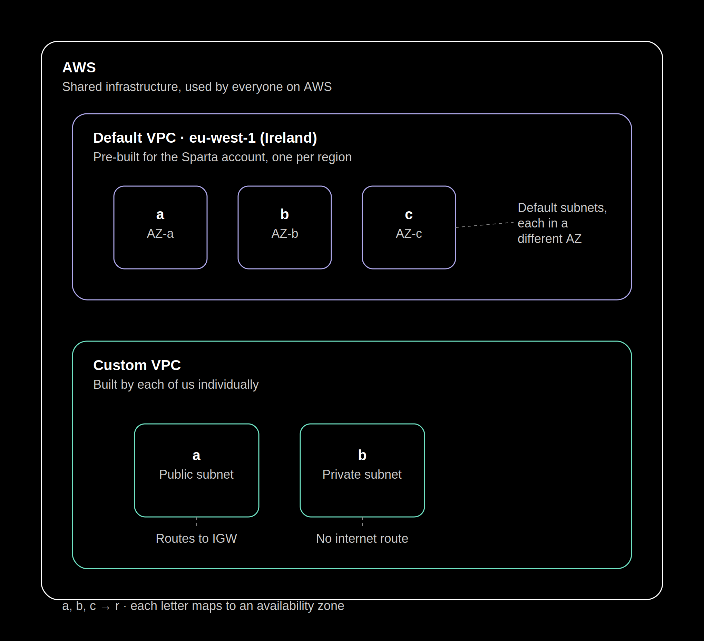
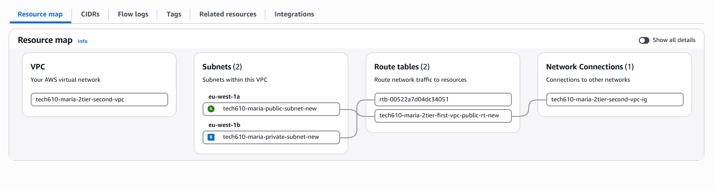
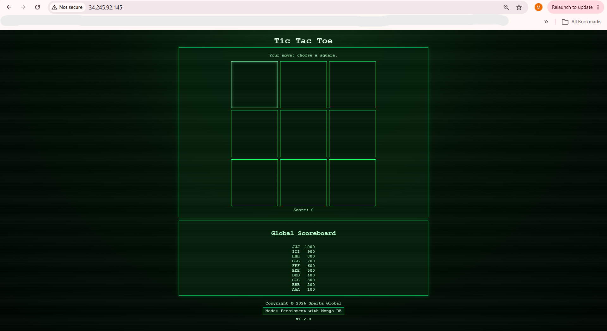

# Two-Tier VPC Architecture Overview

## Overview
This setup builds a custom 2-tier VPC on AWS to host a Tic-Tac-Toe app, separating 
the **public-facing app server** from a **private database server** that has no direct 
internet access.
- [Two-Tier VPC Architecture Overview](#two-tier-vpc-architecture-overview)
  - [Overview](#overview)
  - [Custom VPC](#custom-vpc)
  - [Components](#components)
  - [Architecture:](#architecture)
  - [Key Security Notes](#key-security-notes)
- [1. Creating a VPC](#1-creating-a-vpc)
- [2. Create the public and private subnets](#2-create-the-public-and-private-subnets)
  - [a) Public subnet:](#a-public-subnet)
  - [b) Private subnet:](#b-private-subnet)
- [3. Create the internet gateway \& attach to the VPC](#3-create-the-internet-gateway--attach-to-the-vpc)
  - [a) Attaching the Internet gateway to the VPC](#a-attaching-the-internet-gateway-to-the-vpc)
- [4. Create public route table](#4-create-public-route-table)
- [5. Create database VM](#5-create-database-vm)
- [6. Create app VM](#6-create-app-vm)
  - [Reflection](#reflection)

## Custom VPC
A custom VPC is your own private network inside AWS. Unlike the default VPC (which comes pre-built for everyone, which we used for previous instances), you design it yourself. You pick the IP range, create your own subnets, and decide which ones are public (with internet access for app) and which are private (isolated, like for a database).
>
> **Image visualizing the differences between the architecture of default VS custom VPC.alt text**

## Components

| Component | Name | Purpose |
|-----------|------|---------|
| VPC | `tech610-maria-2tier-first-vpc` | Custom network (10.0.0.0/16) |
| Public Subnet | `tech610-maria-public-subnet` | 10.0.2.0/24 — hosts App VM |
| Private Subnet | `tech610-maria-private-subnet` | 10.0.3.0/24 — hosts DB VM |
| Internet Gateway | `tech610-maria-2tier-first-vpc-ig` | Enables internet access for public subnet |
| Route Table | `tech610-maria-2tier-first-vpc-public-rt` | Routes 0.0.0.0/0 traffic to IGW |
| DB VM | `tech610-maria-db-launch-with-custom-vpc` | MongoDB, private subnet, SSH + port 27017 only |
| App VM | `tech610-maria-app-launch-with-custom-vpc-two-tier-new` | App server, public subnet, SSH + HTTP |

## Architecture:
>.png>)
>**Image visualizing the two tier architecture of the custom VPC for the Tictactoe app** 


## Key Security Notes
- **App VM security group**: allows SSH (22) from anywhere + HTTP (80) from anywhere
- **DB VM security group**: allows SSH (22) from your IP only + MongoDB (27017) restricted to `10.0.2.0/24` (public subnet only)
- **Private subnet** has no route to the Internet Gateway — DB is isolated and must rely on a custom AMI with everything pre-installed
- **App VM** connects to DB using its private IP via `MONGODB_URI` env variable set in user data


# 1. Creating a VPC

1. Search VPC -> Create VPC

2. Select VPC only
3. Name it: `tech610-maria-2tier-first-vpc`
4. IPv4 CIDR: `10.0.0.0/16`
5. Route table is the `default` on
6. Click `Create VPC`
------------


# 2. Create the public and private subnets

## a) Public subnet:
1. Go to subnet on the left hand side

2. Click create subnet 
3. Find and select your named VPC: `tech610-maria-2tier-first-vpc`
4. Name your public subnet: `tech610-maria-public-subnet`

5. Select Availability Zone: `Europe(ireland. euw1-az3*eu-west-1a)`

6. Type the IPv4 subnet CIDR block: `10.0.2.0/24`

> **Note:** *The first 24 bits (first 3 segements) will start with 10.0.2 and cannot be changed. Only the last segment (which is the last 8 bits can be changed.)*
.
## b) Private subnet:

1. Click `add new subnet` at the bottom of the page

2. Name it: `tech610-maria-private-subnet`

3. Select Availability Zone: `Europe(ireland. euw1-az3*eu-west-1b)`
4. Type the IPv4 subnet CIDR block: `10.0.3.0/24`

------------------

# 3. Create the internet gateway & attach to the VPC

1. Click create internet gateway
2. Name it: `tech610-maria-2tier-first-vpc-ig`
3. Click create and should see this message:
The following internet gateway was created: 
 `*igw-0b3c6db62d506e4d1 - tech610-maria-2tier-first-vpc-ig`

 > **Note:** *You can now attach to a VPC to enable the VPC to communicate with the internet:*

## a) Attaching the Internet gateway to the VPC

1. Go to the Actions bar
2. Drop down & select `Attach VPC`
3. Search your VPC and click attch
4. Status of `tech610-maria-2tier-first-vpc-ig` should now say: `Attached`

_________________
# 4. Create public route table

1. Click route tables, left bar
2. Create route table, top right 
> *Create custom routing to let traffic outside your network come in. Traffic won't even go to your internet gateway without this.*

3. Name it: `tech610-maria-2tier-first-vpc-public-rt`

4. Filter for your VPC

5. Create route table

**Next: Now need to create route allowing internet gateway**

8. Go to YOUR route table -> open the link -> subnet associations -> edit subnet association
9. Select public subnet as explicit route (where the traffic will be going to -> click `Save Associations`)

10. Go to routes -> Edit routes


| Route | Destination | Target | Status | Propagated | Route Origin |
|-------|------------|--------|--------|------------|---------------|
| Route 1 | 10.0.0.0/16 | local | Active | No | CreateRouteTable |
| Route 2 | 0.0.0.0/0 | Internet Gateway (igw-0b3c6db62d506e4d1) | – | No | CreateRoute |
|


11. Save the changes and you should see:
***`'Updated routes for rtb-0b08078e18bfa3e3a / tech610-maria-2tier-first-vpc-public-rt successfully'`***

12. Go to `My VPC` and select your VPC link 

>**Expected outcome:** The resource map where eveything is located including: subnets, route tables, public, private e.c.t , connnected to internet gateway 
> 
> 
> **Image showing the Resource map under My VPC**

-------------------
# 5. Create database VM
Will need to use custom database AMI because it does not have access to the internet
There's no direct access to the database vm through the internet and no route for it to follow to get out onto the internet 
It's on the private subnet
This is why it needs to have everything already in store


1. Launch instance from AMI (database)
name it `tech610-maria-db-launch-with-custom-vpc`

2. Select your key

3. Create and name new security group so that you can use your custom VPC- consider: SSH from my IP and mongodb on port 27017: `tech610-maria-two-tier-allow-ssh-from-my-ip-and-mongodb-new`

4. Inbound sg rules:

> 1. ssh, Port range 22, Source type: My IP`
> 2. Custom TPC, Port range 27017, Source type: 10.0.2.0/24`

5. Launch instance

6. Get private IP from this database instance

___________

# 6. Create app VM

1. Go to AMI and find app AMI -> launch instance
2. Name it `tech610-maria-app-launch-with-custom-vpc-two-tier-new`
3. Select key pair
4. Select custom VPC -> Enable auto-assign public IP
4. Create security group -> Name it: `tech610-maria-2tier-allow-ssh-my-ip-http-new`

5. Allow SSH from anywhere -> Allow HTTP traffic from anywhere

6. Add user data under `Advanced details`:
```bash
#!/bin/bash

export MONGODB_URI=mongodb://10.0.2.78:27017/tictactoe

cd /tech610-tic-tac-toe/app

pm2 start index.js --name tic
```

9. Double check for any errors & launch the instance

10. Find the public IP of app instance- launch the app using `http://` in conjunction with it 

> **Expected Output**
>

## Reflection

I have learnt how to build a custom VPC in AWS. I did this by creating public and private subnets, attaching an internet gateway, and configuring route tables so only the public subnet can reach the internet. I also ran the app and database using AMIs within the custom VPC, keeping the database isolated in a private subnet for better security.