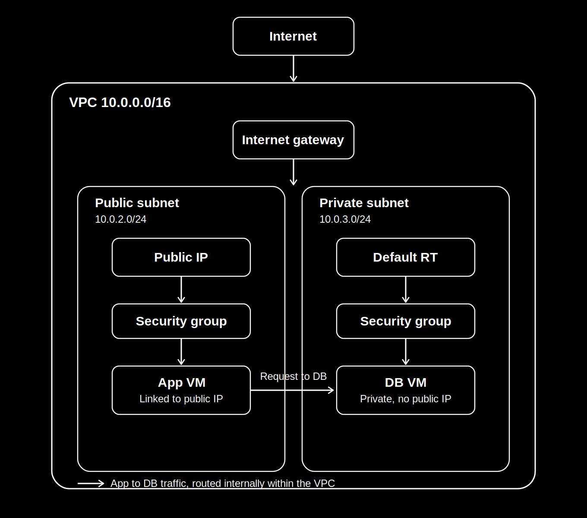

# Understanding VPCs
VPC- Virtual private cloud (AWS)
VN- Virtul Network (Azure)

## Understanding a custom VPC:
On AWS we share the platform with everyone
We have our spata accounts on AWS
Within this, we have a default VPC for the Ireland region
### Within the default VPC:

#### Default: different subnets because each subntet is linked to a different availability zone in a geographic region

We can create a custom VPC to have full control over our architecture 
We will have: 
> 2 subnets associated with:
> - avaialbility zone A and B
**Advantage of less subnets**: 
* This means that less connections (living in the apartment) and therefore less risk to security.

* On your own VPC you get to choose which subnets will be public and private 

## Understanding the VPC we will set up

### Ciderblock: 
> 10.0.0.0/16
The /16 after the IP adress is what makes it a ciderblock 

This will be a range of IP addresses 
The address base will be private 

We want to control the flow and direction of traffic (water) in our network which is why we have to control security groups, also the entry point into the network (the internet gateway)

Traffic allowed in from:
 public ip linked to app vm
 internet traffic from port HTTP -> public ip linked to app vm -> internet gateway ->

 If you set up your default, there is no internet gateway unless you manually set it up; you will need:

> Public route table
> - allowing public traffic into the network from a public place
> - by default allows internal traffic so VNs can talk to each other
> Traffic coming from outside the network could be risky but internally should typically eb fine
> Coming in from the outside, mus go through th einternet gateway to the app's vm, specifically the route table, we specify that the it goes to the subnet of the app's VM

> Will have to attach internet gateway to VPC
> Will have to make the db virtual machine first as we need the privae ip address of the db into the vm 

Overview
Using routing, controlling the flow of traffic so that internet routing will only go over the subnet